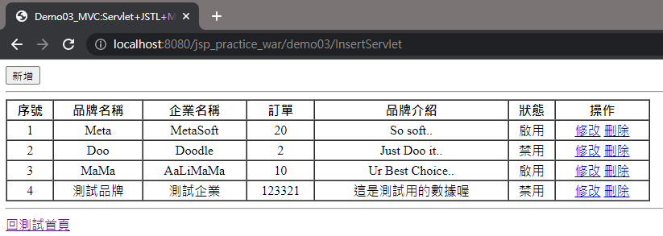

# 說明

* 本練習係學習JSP之使用，共包含下列三個練習：
  * 練習1：單獨由JSP腳本處理及展示動態數據
  * 練習2：由Servlet負責處理數據後，使用JSP標準標籤庫(JSTL)展示動態數據
  * 練習3：結合Servlet+JSTL+Mybatis+MySQL實現CRUD(MVC三層架構)
* 各部分練習展示結果如下：
  * 主頁面：
    * 
  * 練習1：
    * 前端頁面：
      * 
    * 後臺輸出：
      * 
  * 練習2：
    * 前端頁面：

      * 
    * 後臺輸出：

      * 
  * 練習3：
    * 查詢：
      * 前端頁面：
        * 
      * 後臺輸出：
        * 
    * 新增：
      * 前端頁面：
        * 
        * 
        * 
      * 後臺輸出：
        * 
    * 更新：
      * 前端頁面：
        * 
        * 
        * 
      * 後臺輸出：
        * 
    * 刪除：(刪除最後一筆資料)
      * 前端頁面：
        * 
        * 
      * 後臺輸出：
        * 
